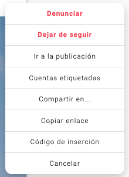
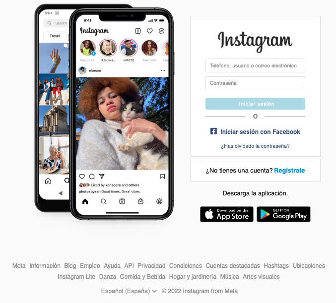
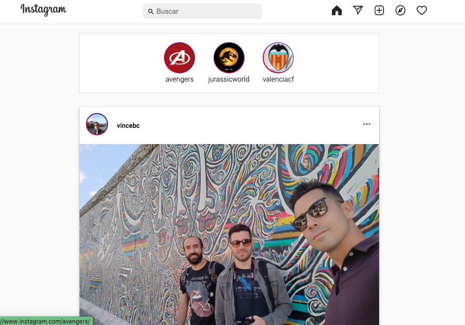

# About The Project -

## Instagram Clone

Instagram Clone built width HTML, CSS & Javascript.

## Project Objective

The main objective of this project is to put into practice all that has been learnt in the last weeks of HTML5, CSS & Responsive Web Design.

The project contains the Login Page & de User's Page.

## Built with...

_This Project was developed with the following technologies_

- HTML
- CSS
- JS

## Challenges

The only JS interaction in this project can be found in the User’s Page, inside the top of the card we can see 3 points, if you press the button a menu will pop up, just like on the original Instagram page.

```
# code block
function myFunction1(){
document.querySelector(‘.key1’).classList.toggle(‘show’);
}
```



### Getting Started - Installation

To deploy this project you must clone the repository through the following link:

```
https://github.com/Vincecoorp21/Instagram-Clone
```

#### Preview




## Author

👤 **Vince BC**

- Twitter: [@VinceTrend](https://twitter.com/VinceTrend)
- Github: [@Vincecoorp21](https://github.com/Vincecoorp21)
- Linkedin:[@vibarcar](https://www.linkedin.com/in/vibarcar/)

This project was developed By [Vicente Barberá - Vince BC -](https://github.com/Vincecoorp21)
